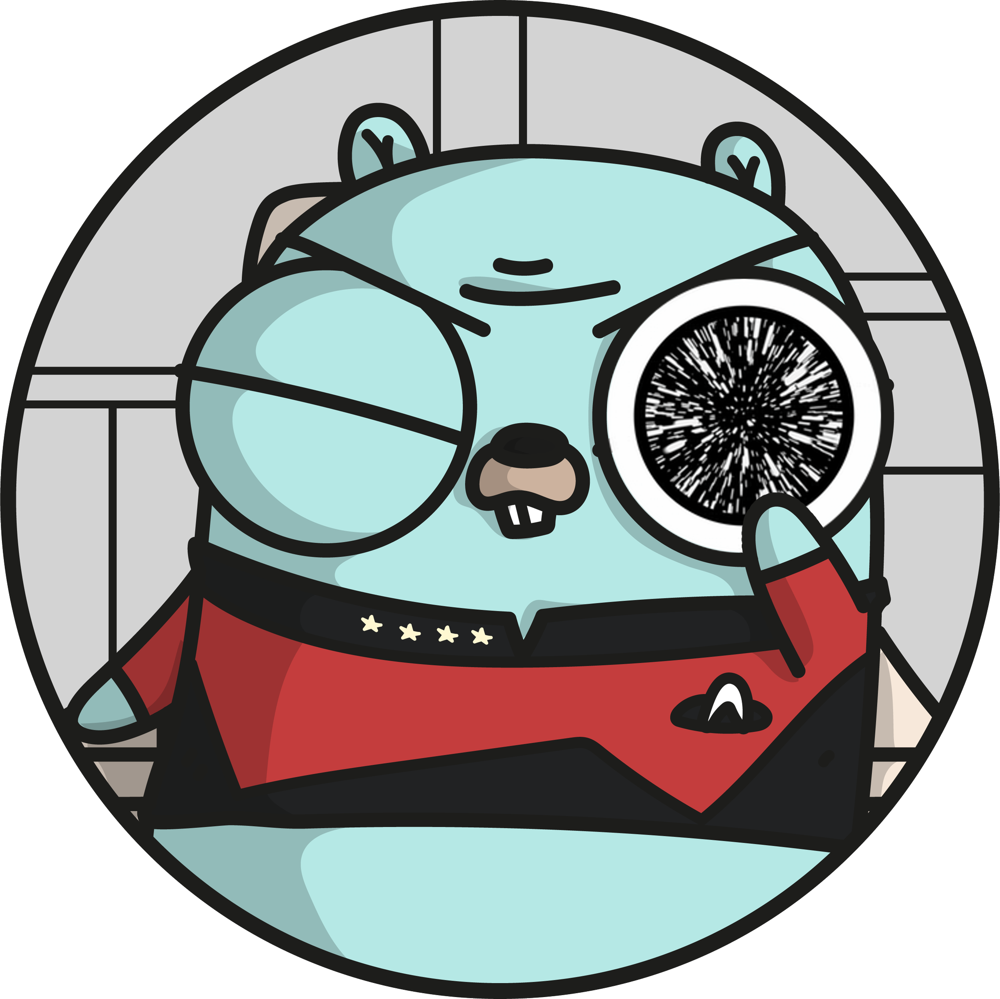

# go-warp10 package

This package contains tools which aims to help you build applications over Warp10 platform.

- [Low-level Warp10 bindings](./base/WARP10.md)
- [WarpScript executor](./query/QUERY.md)
- [Code instrumentation](./instrumentation/INSTRUMENTATION.md)
